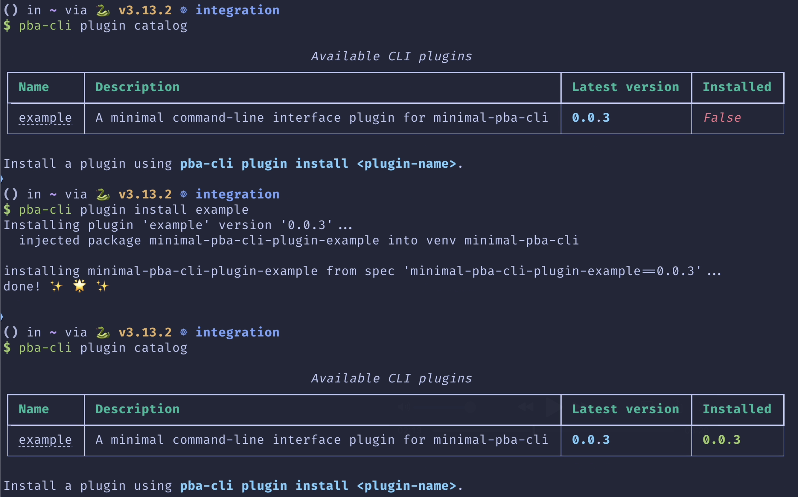

# Minimal command-line interface using a plugin-based architecture

[](./demo.mp4)

This project demonstrates a minimal (but featureful) command-line interface (CLI) using a plugin-based architecture (PBA).
The CLI itself is constructed using [Typer](https://typer.tiangolo.com).

The PBA is achieved using a combination of:

- [pipx](https://pypa.github.io/pipx/)
- [importlib](https://docs.python.org/3/library/importlib.html)
- [packaging](https://packaging.pypa.io/)
- [Libraries.io](https://libraries.io/)

For a working plugin example, see [minimal-pba-cli-plugin-example](https://github.com/easy-as-python/minimal-pba-cli-plugin-example).

## Installation

Install the core CLI using the following command:

```shell
$ pipx install minimal-pba-cli
```

## Usage

List available commands using the help:

```shell
$ pba-cli --help
```

### Plugins

List available plugins using the following command (requires a Libraries.io API key):

```shell
LIBRARIES_IO_API_KEY=<your API key> pba-cli plugin catalog
```

Install a plugin using the following command:

```shell
$ pba-cli plugin install <plugin name>
```

List installed plugins using the following command:

```shell
$ pba-cli plugin list
```

Install a plugin from a local directory using the following command:

```shell
$ pba-cli plugin install-local <path to plugin directory>
```

Uninstall a plugin using the following command:

```shell
$ pba-cli plugin uninstall <plugin name>
```

### Custom scripts

To create a custom script that registers in the CLI, create an executable anywhere on your `PATH` that follows the naming convention `minimal-pba-cli-<name>`.
This script will be registered as a command named `<name>` in the CLI.

As an example, create a script named `minimal-pba-cli-hello` with the following content:

```shell
#!/usr/bin/env sh

echo "Hello, world!"
```

Make the script executable:

```shell
$ chmod +x minimal-pba-cli-hello
```

Now, if the script is located in a directory on your `PATH`, you can run it using the following command:

```shell
$ pba-cli hello
Hello, world!
```

Scripts can be written in any language, as long as they are executable and follow the naming convention:

```python
#!/usr/bin/env python

# minimal-pba-cli-quote

import json
import urllib.request


if __name__ == "__main__":
    response = urllib.request.urlopen("https://zenquotes.io/api/random")
    data = json.loads(response.read().decode("utf-8"))
    print(f"""
"{data[0]['q']}"

- {data[0]['a']}
""")
```

```shell
$ pba-cli quote

"Educating the mind without educating the heart is no education at all."

- Aristotle
```
